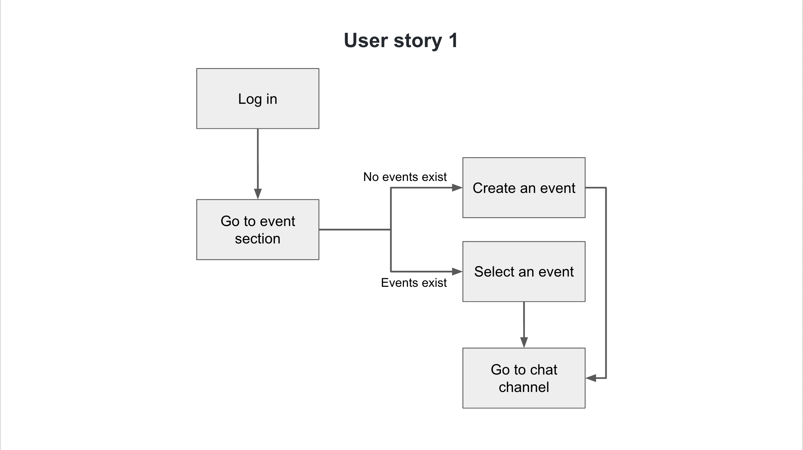

# Specification Phase Exercise

A little exercise to get started with the specification phase of the software development lifecycle. See the [instructions](instructions.md) for more detail.

## Team members

- David Adler: https://github.com/dov212
- Iris Qian: https://github.com/okkiris
- Wenni Fan: https://github.com/fwenni
- Vincent Xu: https://github.com/yx-xyc

## Stakeholders

### Helen Zhao (Chief Marketing Officer of Smart Women Security E-board member of Phi Chi Theta)
- Problems/Frustrations: 
  1. She wants to cohost some events with other clubs, but she always finds that other clubs have repetitive events scheduled in advance and they are not feasible.. 
- Goals/Needs: 
  1. She needs a platform that clubs can exchange information or resources such that they can better communicate with each other and keep everything updated.

### Lawrence Jiang (President of Aviation Club)
- Problems/Frustrations: 
  1. Currently, when he run the club, he has to use multiple application including NYU engage for checking attendance, facebook messenger to communicate with e-board members, and emails to communicate with different clubs for cooperation. It would be annoying for him to jump around among these apps and it's easy form him to miss some messages. 
  2. It's really hard to keep all the club members' information organized in one place. 
- Needs/Goals: 
  1. He want a application that contains all these functionality together and he also want the application easy to use. In other words, he want the application only has the most basic management functionality only. 
### Maria Bermudez (President of United Nation International Children's Emergency Fund)
- Problems/Frustrations:
  1. She always finds NYU Engage is hard to use, since it is not clearly labeled, everything is in different forms.
- Needs/Goals: 
  1. She finds a private channel for each event very helpful, since currently she is using a group chat for everything, and it is hard to go back and find the historical messenger.
  2. She also finds a place to post resources that can be shared will also be very useful, since currently the E-board members need to reach out to other clubs’ E-board for resource sharing. This process can be long.
  3. She wants a function to keep track of how successful an event is, so that the E-board members can know what events to host again.

## Product Vision Statement

This application is designed for club e-board members to manage their club by organizing events, checking their members' participation, communicating with other e-board members, and connecting with other clubs. 

## User Requirements

1. As an E-board member, I want to communicate with other E-board members so that we can plan events.
2. As an E-board member, I want to find another club manager interested in our plan so that we can co-host an event.
3. As an E-board member, I want to create a new upcoming event so that our E-board members can check the situation of that event.
4. As an E-board member, I want to check club members' information so that I can keep track of their attendance.
5. As an E-board member, I want to check club members' information so that I can get their contact information.
6. As an E-board member, I want to create a new post in the resource section such that other clubs can participate in our activities. 
7. As an E-board member, I want to download the emails of members as a csv such that I can easily get access to contact information of all members.
8. As an E-board member, I want to find all the history events so I can know which event I should host again.
9. As an E-board member, I want to update my profile so that other members can see my change.
10. As an E-board member, I want to receive notifications whenever someone interacts with the community so that I can respond promptly to what they need.

## Activity Diagrams
### User Story 1
As an E-board member, I want to communicate with other E-board members so that we can plan events.

### User Story 2
As an E-board member, I want to find another club manager interested in our plan so that we can co-host an event.

## Clickable Prototype
[Figma Prototype](https://www.figma.com/proto/YPYyqFeO43RzC5cTA6ScTO/Convo-App?node-id=28%3A2&scaling=scale-down&page-id=0%3A1&starting-point-node-id=28%3A2)